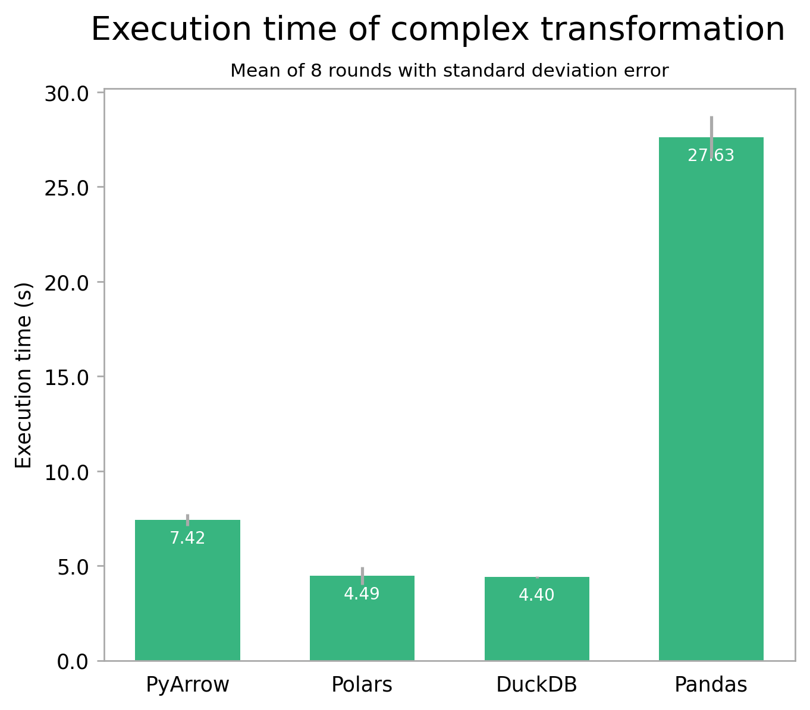

# Transforming Tabular Data in Python

_Comparing Pandas v. Polars v. PyArrow v. DuckDB_


<!--  -->

Let me set the scene: you're brimming with excitement to explore that shiny new data. Luckily it’s manageable enough to use your own computer; so you grab the nearest Python notebook or REPL, ready to start hacking away. But which library to use? Naturally you could reach for trusty old [Pandas](https://pandas.pydata.org/). But what about a fancy new dataframe library like [Polars](https://www.pola.rs/) or [datatable](https://github.com/h2oai/datatable)? Or you can try out embedded SQL with [DuckDB](https://duckdb.org/) for a change.

Let’s delve into the dazzling domain of dataframes to make some sense of all this choice!

__tldr;__ _Use DuckDB if you're comfortable with SQL, use Polars or Pandas backed by PyArrow unless you need some specific extension, and only use PyArrow if you don't mind manually optimizing._

## Introduction

It all starts with the humble table. A concept that was never truly ‘invented’ as much as it has been continually refined from the earliest forms of record keeping. Even today – or rather, especially today, methods to store and transform data in tables keep evolving. From relational databases like PostgreSQL that are more capable than ever, to extremely scalable map-reduce solutions like Dask or Spark. And, of course, the irreplaceable Spreadsheet.

But back to your predicament: you want to work in Python and keep it simple, so no standalone SQL or distributed systems. In that case there's all the dataframe and datatable frameworks to choose from. Let's compare four popular ones: [Pandas](https://pandas.pydata.org/) (the incumbent), [Polars](https://www.pola.rs/) (a challenger), [PyArrow](https://arrow.apache.org/docs/python/index.html) (low level columnar), and [DuckDB](https://duckdb.org/) (in-process/embedded analytical SQL). 


## Docs & Ecosystem

As with any new library to try out, ease of use and how quickly you can start hacking is a big consideration. The strongest contenders in this regard are Pandas and DuckDB. __Pandas has a huge ecosystem of documentation, tutorials, and Q&A threads__. And if some datatype is not built-in, there's a good chance someone has already written a library for it. How __DuckDB__ compares __depends on your familiarity with SQL__ (check out our [previous blog post on it](https://dataroots.io/research/contributions/what-the-duckdb/) for some context). For some it may even be easier than writing Python. In that case it's probably quicker to get started with than Pandas, given that DuckDB's Python API is already well documented.

__Polars__ too is documented extensively. But it cannot compete with Pandas in terms of ecosystem and support (it has more than 200 times less questions on StackOverflow). Error messages from Polars can also be quite cryptic at times, due to the extra layers of abstraction it uses (Rust and Arrow). This all makes experimenting for first time users a bit more difficult.

Lastly, __PyArrow__ is intentionally a __lower-level__ framework. It is in large part meant as a building block for other libraries. This is reflected in the documentation, which is more technical and less tutorial-like. If you're willing to put in the effort though, it's a very __powerful__ tool.


## Gotta Go Fast

Pandas can only run at about 30 km/h, so they're no match for the 80 km/h+ airspeed some ducks can reach... Ah wait no, Python libraries, not fauna. Let's try that again.

Using an approximately 2.5 GB / 8,500,000 row dataset of bird sightings with taxonomic information, I ran some [benchmarks on the four libraries](https://github.com/datarootsio/transforming-tabular-data). The first test performs a simple groupby operation, counting the number of sightings per species using a part of the dataset. On my machine (M2 Pro MacBook, 16GB RAM), this transformation takes a pretty comparable 60 milliseconds with PyArrow, 130 with Polars, and 160 with DuckDB. Pandas is an interesting case though: using its default c engine, it is by far the slowest, taking over 1.6 seconds to complete. Using its [experimental PyArrow engine](https://datapythonista.me/blog/pandas-20-and-the-arrow-revolution-part-i) though, the results are in for a shakeup: Pandas beats all but PyArrow, taking only 80ms. While the absolute numbers don't matter much, the relative difference between the libraries is quite telling. This also translates well to other simple operations and smaller datasets.


Looking at a more involved transformation which uses the whole dataset, things do change a bit. The second test performs two joins and some column computations, counting the number of sightings per species per taxon and within a certain geographical area. Unfortunately it isn't possible to use the PyArrow engine here yet, so you'll just have to imagine Pandas with PyArrow would perform similarly to Polars here [1].



The big picture of both tests is the same though: performance of Polars, DuckDB, and – likely – Pandas with PyArrow is comparable, while Pandas with its default engine is much slower. For very small datasets, this difference might be negligible. But for medium datasets like this one, and especially for large datasets or recurring tasks, the impact can be significant.

It's also a good idea to use a higher level library like Polars or DuckDB over PyArrow, because the latter requires much more care to optimize performance. 


## Code Comfort

Lastly, let's look at the interface the libraries expose. __Pandas__ has by far the largest API surface, often offering __multiple ways__ to achieve the same result [4]. In my experience this does help to brute force your way to a solution, but it can also be confusing and lead to inconsistent code. __Polars is more opinionated__ in this regard, offering a _consistent and predictable_ API ([Polars Philosophy](https://pola-rs.github.io/polars-book/user-guide/#philosophy)). While sometimes more verbose, Polars code can be more readable as a result. As you could guess from the name it does of course borrow most concepts from Pandas, so if you're already familiar with Pandas, you'll feel right at home. If you're not, the __learning curve__ will no doubt be steeper.

As for __PyArrow__: its __low-level__ Arrow core really shines through. This encourages you to think in the same column-oriented way that data is processed internally. Operations on your data are also more explicit, which – for better or worse – uncovers abstractions that higher level libraries provide.

__DuckDB__'s one and only interface is __SQL__: a breath of fresh air for many in the data science community. You can leverage your existing SQL knowledge, not needing to learn yet another framework. If you're not yet familiar with SQL, it can also be a glass half full situation since you'd be learning a particularly useful skill. Additionally, using DuckDB in your codebase helps bridge the gap between data analysts and engineers thanks to a shared language.

With all this in mind, let's close with a simple example of all four:

```python
"""Add a column to a table indicating whether a bird is of the Anatidae family (ducks, geese, and swans)."""

# Pandas
import pandas as pd

df = pd.read_csv("bird_spot.csv")
df["is_anatidae"] = df["family"] == "anatidae"

# Polars
import polars as pl

df = pl.read_csv("bird_spot.csv")
df = df.with_columns([(pl.col("family") == "anatidae").alias("is_anatidae")])

# PyArrow
import pyarrow.csv
import pyarrow.compute as pc

table = pyarrow.csv.read_csv("bird_spot.csv")
table = table.append_column("is_anatidae", pc.equal(table["family"], "anatidae"))

# DuckDB
import duckdb

table = duckdb.query("""
    SELECT *, family = 'anatidae' AS is_anatidae
    FROM read_csv_auto('bird_spot.csv')
""").fetchall()
```


## Conclusion

I hope I've satisfied your curiosity for Python table transformations beyond the standard library. For a quick summary of the choices discussed, here's my personal take: for educational purposes and cases where __extensibility__ is paramount, __Pandas__ is still a great pick. And once PyArrow becomes the default it might reign again. If you'd rather take the easy road to __performance__ with nearly the same __ease-of-use__, choose __Polars__ for your next green field project. If you're looking for a __low-level__ library to build upon (e.g. to create a library of point-and-click transformations), __PyArrow__ might be the way to go. And if you're looking for a combination of Polars' __speed__ with the ubiquity and accessibility of __SQL__, __DuckDB__ is truly unbeatable.

But most of all, try some out for yourself! There's plenty I haven't even mentioned (H2O.ai's [datatable](https://github.com/h2oai/datatable), [Modin](https://modin.readthedocs.io/en/latest/), [ClickHouse](https://clickhouse.tech/) to name a few). And you can of course try a completely different language: maybe give Julia's [DataFrames](https://dataframes.juliadata.org/stable/) or [R](https://www.r-project.org/) a spin.

<br>

[0]: Feature image licensed under [CC BY-SA 3.0](https://creativecommons.org/licenses/by-sa/3.0/). Panda picture remixed from [Ailuropoda melanoleuca -San Diego Zoo -upper body-8a](https://commons.wikimedia.org/wiki/File:Ailuropoda_melanoleuca_-San_Diego_Zoo_-upper_body-8a.jpg) by [randychiu](https://www.flickr.com/photos/25201018@N04) under [CC BY 2.0](https://creativecommons.org/licenses/by/2.0/). Polar bear picture remixed from [_Polar Bear - Alaska (cropped)_](https://commons.wikimedia.org/wiki/File:Polar_Bear_-_Alaska_(cropped).jpg) by Alan Wilson under [CC BY-SA 3.0](https://creativecommons.org/licenses/by-sa/3.0/deed.en). Duck picture remixed from [_Male mallard duck 2_](https://commons.wikimedia.org/wiki/File:Male_mallard_duck_2.jpg) by [Alain Carpentier](http://alaincarpentier.com/) under the [GNU Free Documentation License, Version 1.2](https://commons.wikimedia.org/wiki/Commons:GNU_Free_Documentation_License,_version_1.2). Archerfish picture remixed from [_Toxotes jaculatrix_](https://commons.wikimedia.org/wiki/File:Toxotes_jaculatrix.jpg) by [Chumps](https://commons.wikimedia.org/wiki/User:Chrumps) under the [GNU Free Documentation License, Version 1.2](https://commons.wikimedia.org/wiki/Commons:GNU_Free_Documentation_License,_version_1.2).  
[1]: The csv files necessary for the complex transformation require special quote handling, see Pandas [issue #52266](https://github.com/pandas-dev/pandas/issues/52266) on this.  
[2]: Although speculative, the reversal of the order between PyArrow, Polars, and DuckDB might be due to higher-level optimizations the latter two can perform. The low-level access that PyArrow grants is a double-edged sword in this regard, allowing, but also requiring manual optimizations to squeeze out that last drop of performance. For more benchmarks, also check out the _Database-like ops benchmark_ by [H2O.ai](https://h2o.ai/) (the makers of [datatable](https://github.com/h2oai/datatable)).  
[3]: In case you want to speed up an existing Pandas project that relies on NumPy or its Python engine without resorting to switching between frameworks, consider using Cython or Numba. See [_Enhancing performance_](https://pandas.pydata.org/docs/user_guide/enhancingperf.html) from the docs.  
[4]: Arguably interfering with [The Zen of Python](https://peps.python.org/pep-0020/) at times.
